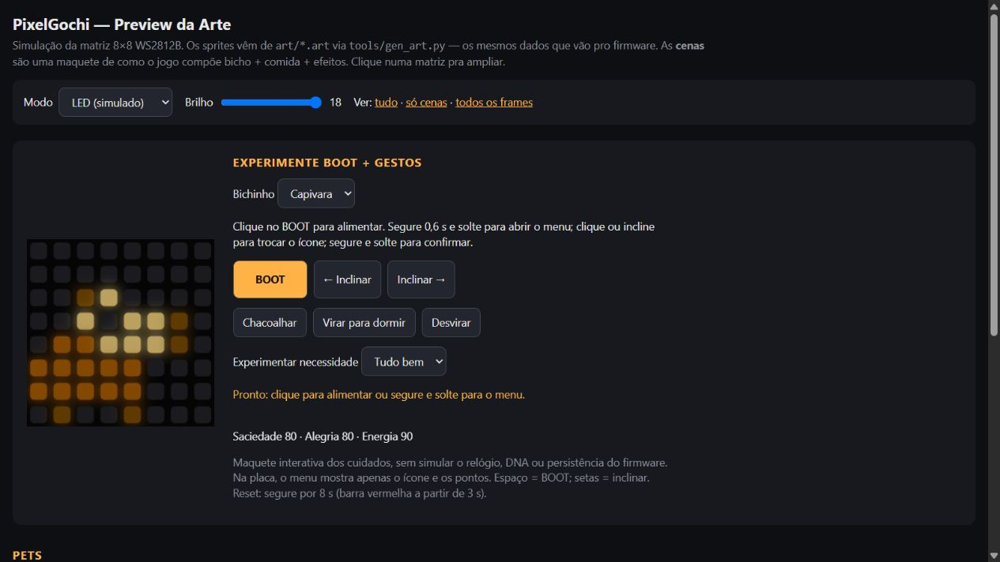
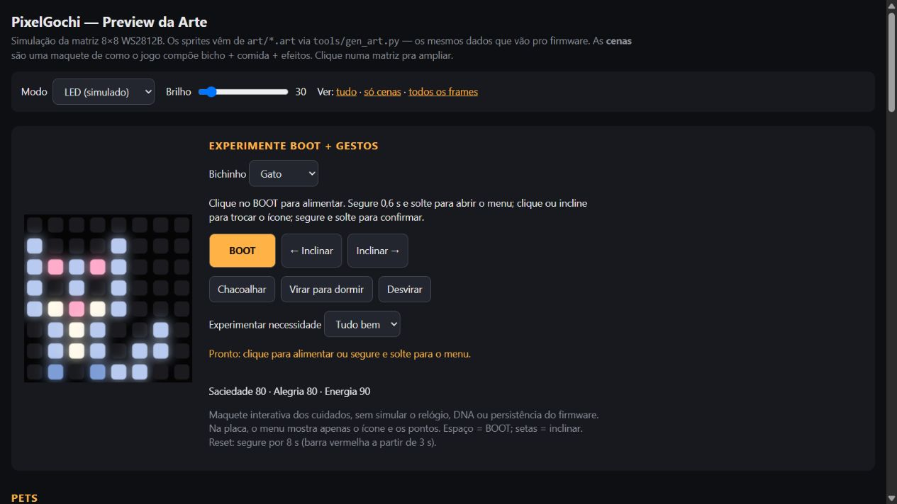
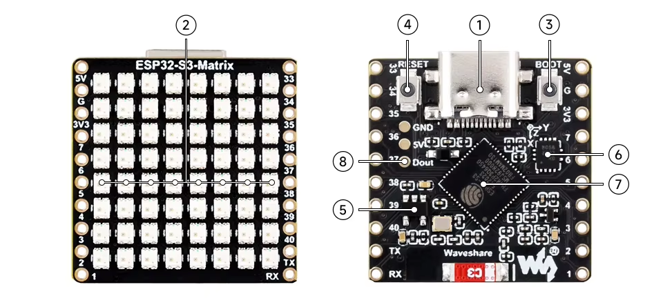
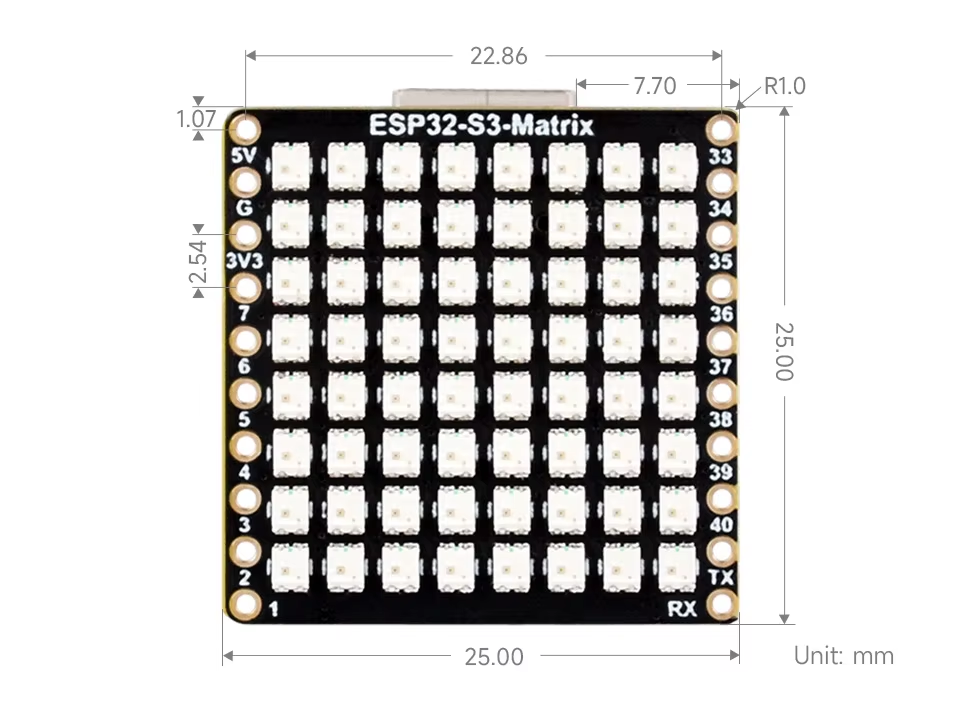
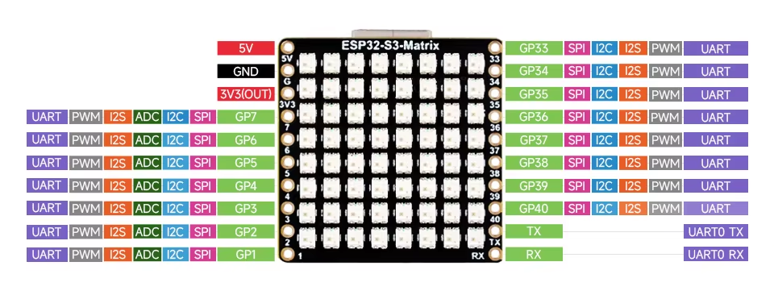
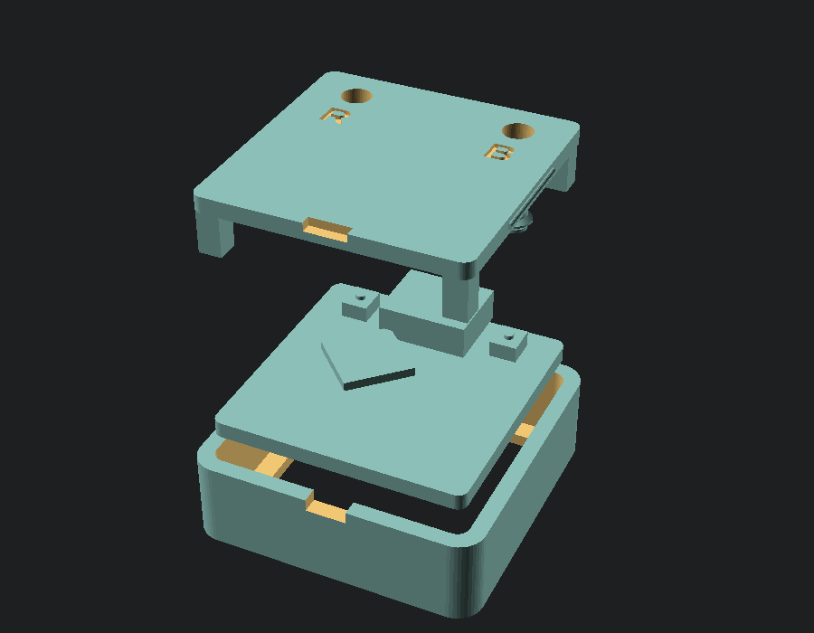

# PixelGotchi

Bichinho virtual na **Waveshare ESP32-S3-Matrix**, com matriz RGB de
**8×8 LEDs**, botão **BOOT** e acelerômetro **QMI8658**. Funciona sozinho,
sem Wi-Fi, celular ou botões adicionais.

**Comprei a placa:** [instalar direto pelo navegador](https://pantojinho.github.io/PixelGotchi/install.html) ·
[instalação manual](#instalação-manual-via-usb) ·
[prompt para uma IA instalar](#prompt-para-instalação-assistida-por-ia) ·
[plano e resultados dos testes](docs/TESTES.md) ·
[próxima sprint: editor e USB](docs/PROXIMA-SPRINT.md).

## Como ficou

Capturas do **preview web**, com os mesmos sprites usados no firmware.
São uma demonstração do visual e dos controles; não são fotos dos LEDs físicos.

| Capivara | Gato |
|---|---|
|  |  |

<details>
<summary>Ver as poses atualizadas da capivara</summary>


</details>

<details>
<summary>Ver um exemplo da galeria de animações</summary>


A galeria permite conferir as poses de cada espécie antes de gravar a placa.

</details>

## Pets e visual

Capivara, gato, sapo, pintinho, coelho e axolote. Cada espécie tem
animações de descanso, caminhada, piscar, comer, dormir, felicidade,
tristeza (a lágrima escorre), fome e cansaço (cabeceando e bocejando),
além de uma paleta de ovo e uma variante selvagem.

- **Gato:** sentado, orelhas triangulares com interior rosa, olhos
  apagados, focinho e peito creme, patas e cauda que se mexe.
- **Capivara:** de perfil, corpo arredondado, orelha pequena, focinho
  comprido e largo, nariz separado e pernas curtas. Quando feliz,
  equilibra uma tangerina na cabeça.
- Durante os cuidados, comida e corações usam **pixels livres ao redor do pet**, preservando a
  silhueta e o rosto mesmo com apenas 64 pixels. Dormir usa uma pose
  mais baixa e reduz o brilho.
- A capivara descansa e fareja mais; o gato observa e persegue mais.
  O DNA continua variando personalidade e tonalidade de cada indivíduo.
- Cada bicho tem um **nome próprio** tirado do DNA (ex.: KALU, MOBITE).
  Ele se apresenta ao nascer, abre a tela de status e vai na lápide.
- Cansado (energia < 25), ele fica parado cabeceando. Se ninguém clicar
  nem fizer um gesto por 30 s, dorme sozinho; dormindo recupera 1 de
  energia por minuto e acorda sozinho quando enche.

### Sonhos e Conway

Depois de 2 minutos sem BOOT nem movimento, com energia suficiente e sem
necessidade urgente, um ambiente procedural aparece ao redor do pet por 7 s
a cada 45 s, preservando sua silhueta.
Algumas visitas incluem um passarinho atravessando a tela. Ao dormir — pelo
menu, pelo gesto ou pelo cochilo automático de energia baixa — ele fica
visível por 8 s e depois a matriz inteira vira um sonho de Conway. Mexer ou
chacoalhar a placa mostra o pet dormindo por mais 8 s; isso não o acorda.
O BOOT acorda o pet normalmente, e ele também acorda quando recupera toda a
energia. Assim o cochilo automático usa o mesmo sonho longo.

Uma transição de 1,2 s leva da pose dormindo ao mundo inteiro, sem apagão.
Os capítulos renovam em até 30 s; padrões imóveis renovam após 20 s e padrões
vazios são substituídos imediatamente. Os sonhos evoluem uma geração a cada meio segundo. DNA e estado do pet
escolhem entre sementes estáveis (incluindo o glider, que cruza as bordas
conectadas da grade) ou padrões mais turbulentos; tons frios indicam um sonho
tranquilo e tons quentes um sonho inquieto. Isso só muda a exibição: não
altera fome, energia nem as regras de alimentação. O formato de grade 8×8,
as regras e o glider seguem a referência do
[Jogo da Vida em matriz de LEDs](https://www.makerguides.com/game-of-life-dot-matrix-max7219/).
Os tempos do preview são encurtados para a demonstração; o firmware usa os
tempos acima. Veja o [roteiro dos sonhos](docs/TESTES.md#sonhos-e-conway).
O [plano de animações e Conway](docs/ANIMACOES-E-CONWAY.md) registra a
implementação e os critérios para conferir na placa.

Os desenhos são originais, feitos diretamente na grade de pixels.
Referências de forma: [perfil de capivara (WWF)](https://www.wwf.or.jp/staffblog/news/5510.html)
e [silhueta de gato sentado](https://freesvg.org/black-cat-vector-image).
As imagens de referência não são distribuídas no projeto.

## Controles

**Uma regra para os menus: clique troca, segurar e soltar confirma.**
Após **0,6 s**, um ponto verde no canto superior direito indica que já
pode soltar. A ação longa só acontece ao soltar o botão.

| Situação | Entrada | Resultado |
|---|---|---|
| Seleção inicial | Clique no BOOT ou incline para um lado | Próxima espécie; inclinar à esquerda volta |
| Seleção inicial | Segure BOOT por 0,6 s e solte | Escolhe a espécie e começa o ovo |
| Ovo | Movimente suavemente a placa | Acumula incubação: 5 minutos; parar por 15 s pausa, sem zerar |
| Ovo | Clique no BOOT | Mostra o progresso no topo por 2 s |
| Pet acordado | Clique no BOOT | Alimenta, com animação de comida → mastigação → coração |
| Pet dormindo | Clique no BOOT | Acorda; não alimenta junto |
| Vida | Segure BOOT por 0,6 s e solte | Abre o menu no cuidado mais urgente |
| Menu | Clique ou incline | Troca o ícone; volte ao centro antes da próxima inclinação |
| Menu | Segure BOOT por 0,6 s e solte | Executa o cuidado selecionado |
| Vida | Chacoalhe | Brinca: alegria +20, energia −8, saciedade −3; pausa de 5 s entre gestos |
| Vida | Incline lateralmente | O pet acompanha o lado mais baixo |
| Vida | Vire a matriz para baixo por 1,5 s | Dorme |
| Sono iniciado pelo gesto | Desvire | Acorda; o sono escolhido no menu continua até BOOT/menu ou energia cheia |
| Status | Espere ou clique | Nome → comida → alegria → energia → saúde → idade → volta ao pet |
| Status | Segure BOOT por 0,6 s e solte | Volta ao pet na hora |
| Qualquer cena | Segure BOOT por 8 s | Recomeça na seleção; barra vermelha a partir de 3 s |
| Após a morte | Segure BOOT por 0,6 s e solte | Recomeça na seleção |

### Menu em 8×8

Ordem dos oito ícones/pontos: **maçã (vermelho) · controle (roxo) · bolhas
(azul-claro) · cruz de farmácia (verde) · lua (amarelo) · coração (rosa) ·
barras · voltar (branco)**. O ponto branco na última linha indica a posição.
O menu fecha após 8 s sem entrada. Sem IMU, todos os cuidados continuam
acessíveis pelo BOOT.

**Quando o bicho precisa de algo**, a cada 4 s a tela mostra por um
instante o ícone do menu que resolve. No resto do tempo, um pontinho pisca
no canto superior direito com a cor desse ícone: verde doente, azul-claro
sujo, vermelho fome, amarelo cansado, roxo entediado/triste. Segurar o BOOT
abre o menu já nesse ícone.

**Status**: primeiro passa o nome do bicho. Depois vem uma página por
atributo: ícone em cima, barra de 8 LEDs embaixo e o nome escrito rolando.
COMIDA cheia = satisfeito, ALEGRIA, ENERGIA e SAUDE (vira DOENTE ou SUJO
quando for o caso; cai quando você descuida). Ícone piscando = atributo
baixo. Por fim, a idade em dias.

O menu sugere acordar se estiver dormindo; caso contrário, prioriza doença,
sujeira, fome, cansaço e tristeza. Quando está tudo bem, sugere carinho.
Carinho aumenta a alegria em 5 pontos sem gastar energia.

Sacudidas não interrompem uma animação de cuidado nem acordam o pet.
Comida é recusada se ele já estiver cheio; brincadeira, se faltar energia.
Segurar para reset não executa uma confirmação intermediária.

## Preview no navegador

Para abrir automaticamente e recarregar ao salvar a arte:

```sh
python tools/preview.py
```

Esse comando serve `preview/` em `http://localhost:8765/`. Para escolher
outra porta: `python tools/preview.py 9000`. Pare com `Ctrl+C`.

Para servir o repositório inteiro sem recarga automática:

```sh
python tools/gen_art.py
python -m http.server 8765 --bind 127.0.0.1
```

Abra [o preview local](http://127.0.0.1:8765/preview/). Também é possível
abrir `preview/index.html` diretamente no navegador.

- **Maquete interativa:** escolha a espécie e experimente BOOT, inclinação,
  chacoalhada e sono. **Espaço** funciona como BOOT; as **setas** inclinam.
  O seletor de necessidade permite experimentar fome, tristeza, cansaço,
  sujeira e doença.
- **Galeria:** cenas e todas as poses animadas; clique na matriz para ampliar.
- **Modo LED:** aproxima a aparência com brilho baixo; modo de design
  mostra a paleta original. O brilho do preview não altera o firmware.
- Filtros: `?only=cat`, `?only=capy`, `?view=scenes`, `?view=sprites`.

A maquete usa os mesmos sprites e reproduz os controles dos cuidados.
Ela não executa o firmware nem simula seu relógio, DNA, nascimento,
descuido ou persistência. A aparência óptica real depende dos LEDs.

## Vida e persistência

O estado fica salvo na NVS e sobrevive a reinícios. A fome, felicidade e
energia decaem lentamente, com taxas e personalidade em `src/Config.h`
e `src/Dna.h`. Durante o sono, a energia regenera e a fome cai mais devagar.
O relógio só avança enquanto a placa está ligada.

Sujeira e fome prolongada causam doença. O descuido acumula em estágios:
normal → descuidado → quase selvagem → selvagem. O pet selvagem fica arisco,
procura comida sozinho e pode morrer após cinco dias nessa condição.
Bem cuidado, vive indefinidamente. Esses cuidados já existiam no projeto.

## Hardware e brilho

[Documentação da placa](https://docs.waveshare.com/ESP32-S3-Matrix).



O alvo é a **Waveshare ESP32-S3-Matrix**, de **25 × 25 mm**, com 64 LEDs RGB,
USB-C, BOOT, RESET e QMI8658 integrados. Para jogar e instalar pelo USB,
**não é necessário soldar fios nem adicionar outro botão**. Se comprou no
AliExpress, confira o nome e as duas faces da placa acima: ter apenas um
ESP32 e uma matriz 8×8 não garante a mesma pinagem.

<details>
<summary>Dimensões e pinagem externa</summary>





Os GPIOs da tabela abaixo são conexões **internas** usadas pelo firmware;
não representam fios que você precisa ligar nos conectores da imagem.
As três imagens do hardware foram fornecidas pelo autor do projeto.
Veja também a [referência oficial da Waveshare](https://docs.waveshare.com/ESP32-S3-Matrix).

</details>

| Componente | Pinos |
|---|---|
| 64 LEDs WS2812B, ordem de cor **RGB** (não o GRB comum) | GPIO14 |
| QMI8658, I²C | SDA GPIO11, SCL GPIO12 |
| BOOT | GPIO0 |

O firmware limita o brilho a **5/255** (antes 30, 18 e 13: com mais brilho as
cores vizinhas "sangram" e ficam difíceis de separar), a corrente da matriz
a **400 mA** e usa FastLED **3.6.0**, com driver RMT e sem dithering temporal.
A Waveshare informa que brilho excessivo aquece e pode danificar a placa.

As cores passam por uma **curva gamma suave de 1,6** antes do brilho global.
Ela reduz os meios-tons e ajuda a separar os tons claros e escuros. A capivara
usa corpo cobre, focinho âmbar claro e nariz marrom escuro, com maior distância
entre as cores. Preto continua apagado e as cores primárias continuam puras.

Depois da curva, o **brilho é ajustado por cor**: a soma R+G+B de cada pixel
é limitada (`glare_cap`), então branco e tons claros ofuscam menos que cores
puras; o azul é atenuado (`blue_gain`); e cores escuras nunca ficam abaixo de
`min_peak` degraus, pra não sumirem. Com o pet dormindo, cada LED aceso fica no
menor degrau visível.

O perfil fica em [`art/led-profile.json`](art/led-profile.json) e gera a mesma
tabela para firmware e preview. Para reduzir mais, experimente `"brightness": 4`,
gere a arte e regrave a placa; não aumente o brilho para compensar contraste.
Esse ajuste não apaga o pet salvo. O resultado óptico ainda precisa de
conferência na sua unidade; a curva não é uma calibração medida do hardware.

O BOOT pressionado durante reset/energização entra no modo de gravação
do ESP32. Para interagir, pressione-o **depois** que o firmware iniciar.

Orientação da imagem: `DISPLAY_ROTATION` e `DISPLAY_MIRROR_X` em `src/Config.h`.

**Acelerômetro:** o QMI8658 fica no verso da placa, então "tela pra cima" é o
eixo z **negativo**. Os eixos e sinais ficam em `src/ImuCalib.h`, medidos na
placa real. Se a inclinação ou o "virar pra dormir" se comportarem errado
(outra placa, outro lote), recalibre em 4 posições e grave de novo:

```bash
python tools/calibrate_imu.py
```

Sensibilidade e tempo dos gestos ficam em `src/Config.h`. O IMU tenta os
endereços 0x6B e 0x6A. A primeira amostra não é contada como movimento e o
gesto de virar usa histerese para evitar oscilar entre dormir/acordar.

## Case 3D

Case de **28,7 × 28,7 × 8,6 mm** com acesso ao USB-C, aos botões BOOT e RESET
de trás (por pinos que nunca ficam apertando sozinhos) e argolinha de
chaveiro; versão com janela aberta ou com difusor e grade 8×8. Sem suporte.
Há também uma **versão com bateria** (28,7 × 47,7 × 18,8 mm, LiPo 160 mAh,
carregador TP4056 e chave liga/desliga, carregando pelo mesmo USB-C).
Veja [hardware/case](hardware/case/README.md) (STLs, configuração para a
Ender-3 V3 KE, ligação elétrica e montagem).



## Instalar pelo navegador

Abra o [instalador USB do PixelGotchi](https://pantojinho.github.io/PixelGotchi/install.html) em **Chrome ou
Edge no computador**, conecte a Waveshare ESP32-S3-Matrix com um cabo USB-C
de dados. Confirme o aviso de apagamento, clique no botão para escolher a
porta e selecione **Install** na janela seguinte. Acompanhe o progresso e a
conclusão nessa janela. A página precisa de HTTPS
(ou `localhost`). A imagem completa apaga e regrava os dados da placa,
inclusive o pet salvo. O instalador é compilado do firmware desta revisão e
publicado junto com o preview pelo GitHub Actions. Antes de liberar o botão,
a página confere versão, tamanho e SHA-256 do pacote; a gravação usa esses
mesmos bytes. Se o arquivo estiver ausente ou inconsistente, oferece uma
nova tentativa e mantém a instalação bloqueada.

Na primeira publicação, o dono do repositório precisa habilitar **Settings →
Pages → Source: GitHub Actions**. Depois disso, cada atualização em `master`
compila o firmware e publica o instalador automaticamente. Em seguida, execute
uma vez **Actions → Publish web preview and USB installer → Run workflow**.
Se Pages estiver desativado, o workflow informa falha de configuração após
gerar o artefato. Não sinaliza publicação bem-sucedida sem site disponível.

Para testar o instalador local com o firmware atual:

```powershell
python tools/build_web_installer.py
python tools/preview.py
```

Abra [o instalador local](http://localhost:8765/install.html). O primeiro
comando precisa de PlatformIO instalado e gera binário, manifesto e informações
do firmware. Os binários são gerados pelo build e não entram no Git.

Se a porta não aparecer, feche monitores seriais, confirme o cabo de dados e
tente BOOT pressionado + toque em RESET; solte BOOT e escolha a porta novamente.
Para instalar manualmente ou atualizar com controle dos arquivos e offsets,
siga as instruções abaixo. O envio de arte personalizada para a placa ainda
não está implementado; esta página instala o jogo PixelGotchi.

## Instalação manual via USB

Você precisa da placa acima, de um **cabo USB-C com dados**, acesso à internet
para baixar as ferramentas e um computador Windows, macOS ou Linux.
A gravação substitui o programa de demonstração que veio na placa.

### 1. Baixe o projeto e as ferramentas

Instale [Git](https://git-scm.com/downloads) e [Python 3.12](https://www.python.org/downloads/).
No Windows, habilite o Python no PATH durante a instalação. Abra o terminal
na pasta onde deseja guardar o projeto e execute:

```sh
git clone https://github.com/pantojinho/PixelGotchi.git
cd PixelGotchi
```

Alternativa sem Git: no GitHub, clique **Code → Download ZIP**, extraia tudo
e abra o terminal na pasta que contém `platformio.ini`.

Instale o PlatformIO em um ambiente Python **ao lado** do repositório.
Assim as dependências não entram nos arquivos do projeto.

**Windows — PowerShell:**

```powershell
py -3.12 -m venv ..\pixelgotchi-env
..\pixelgotchi-env\Scripts\python.exe -m pip install platformio==6.2.0
```

**macOS / Linux:**

```sh
python3 -m venv ../pixelgotchi-env
../pixelgotchi-env/bin/python -m pip install platformio==6.2.0
```

Nos próximos exemplos, use o caminho do Python do seu ambiente. Não precisa
ativá-lo. A instalação pode levar alguns minutos na primeira execução.
Referência: [instalação do PlatformIO Core](https://docs.platformio.org/en/stable/core/installation/methods/installer-script.html).

### 2. Conecte e identifique a porta

Ligue o USB-C da placa ao computador. Feche monitores seriais que estejam
usando a placa. Liste os dispositivos:

```powershell
# Windows
..\pixelgotchi-env\Scripts\python.exe -m platformio device list
```

```sh
# macOS / Linux
../pixelgotchi-env/bin/python -m platformio device list
```

Anote a porta que aparece ao conectar e desaparece ao desconectar a placa.
Exemplos: `COM5` no Windows, `/dev/cu.usbmodem...` no macOS ou
`/dev/ttyACM0` no Linux. **São exemplos: use a sua porta.** Se houver várias
placas, identifique esta antes de gravar.
Referências: [listar dispositivos](https://docs.platformio.org/en/stable/core/userguide/device/cmd_list.html)
e [porta de upload](https://docs.platformio.org/en/stable/projectconf/sections/env/options/upload/upload_port.html).

### 3. Compile e grave

**Windows — substitua `COM5` pela sua porta:**

```powershell
..\pixelgotchi-env\Scripts\python.exe -m platformio run -e esp32-s3-matrix
..\pixelgotchi-env\Scripts\python.exe -m platformio run -e esp32-s3-matrix -t upload --upload-port COM5
```

**macOS / Linux — substitua `/dev/ttyACM0` pela sua porta:**

```sh
../pixelgotchi-env/bin/python -m platformio run -e esp32-s3-matrix
../pixelgotchi-env/bin/python -m platformio run -e esp32-s3-matrix -t upload --upload-port /dev/ttyACM0
```

Espere **`[SUCCESS]`** na compilação e na gravação. O PlatformIO baixa o
compilador e as bibliotecas e gera a arte automaticamente. Use o
`platformio.ini` do projeto: o ambiente já configura **flash de 4 MB**,
FastLED 3.6.0 e USB CDC. O nome genérico `esp32-s3-devkitc-1` dentro desse
arquivo é intencional; as adaptações da Matrix estão no próprio projeto.

Se a gravação não conectar, coloque a placa no modo de download:

1. Segure **BOOT**.
2. Pressione e solte **RESET**, mantendo BOOT pressionado.
3. Solte **BOOT**.
4. Liste as portas novamente — o nome pode mudar — e repita o upload.
5. Ao terminar, pressione **RESET** com BOOT solto para iniciar o jogo.

Esse é o modo de gravação do ESP32-S3 descrito pela
[Espressif](https://docs.espressif.com/projects/esptool/en/latest/esp32s3/advanced-topics/boot-mode-selection.html).
Durante o jogo, use BOOT depois da inicialização.

### 4. Confira que iniciou

Abra o monitor e, se necessário, toque RESET para ver a inicialização:

```powershell
# Windows — sua porta pode mudar depois do upload
..\pixelgotchi-env\Scripts\python.exe -m platformio device monitor --port COM5 --baud 115200
```

```sh
# macOS / Linux
../pixelgotchi-env/bin/python -m platformio device monitor --port /dev/ttyACM0 --baud 115200
```

Saída esperada: `[PixelGochi] iniciando...`, `[Imu] QMI8658 ok` e
`[Game] fase=...`. Use `Ctrl+C` para fechar o monitor antes de outro upload.
Na matriz, escolha o pet com cliques; segure BOOT por 0,6 s e solte para
começar o ovo. Movimentos suaves acumulam os cinco minutos de incubação.

| Problema | O que conferir |
|---|---|
| Nenhuma porta aparece | Troque por um cabo com dados e outra porta USB; tente BOOT + RESET e liste de novo |
| Porta ocupada | Feche o monitor serial, outras IDEs e aplicativos que usam essa porta |
| Upload não conecta | Confira a porta atual e use o modo de download acima |
| Linux retorna permissão negada | Ajuste a permissão/grupo da porta conforme sua distribuição; reconecte após a mudança |
| Monitor vazio | Use 115200, confira a porta após o reset e deixe BOOT solto |
| IMU não respondeu | Confirme o modelo exato da placa; o BOOT funciona, mas os gestos exigem o sensor |
| Imagem ou inclinação invertida | Veja `DISPLAY_ROTATION`, `DISPLAY_MIRROR_X` e `TILT_SIGN` na seção de hardware |

Essa placa usa USB nativo do ESP32-S3; não presuma que precisa de um driver
CH340 de outra placa. Para problemas de reconhecimento, consulte a
[documentação da sua Matrix](https://docs.waveshare.com/ESP32-S3-Matrix/Arduino).

**Alternativa gráfica:** abra a pasta do projeto no
[VS Code](https://code.visualstudio.com/) com a extensão
[PlatformIO IDE](https://platformio.org/install/ide?install=vscode).
Em **Project Tasks → esp32-s3-matrix**, execute **Build** e **Upload**;
use o monitor em 115200. Com mais de uma porta disponível, prefira os
comandos acima para escolher explicitamente a placa.

### Atualizar uma instalação existente

Com uma cópia obtida por Git, confira suas alterações antes de atualizar:

```sh
git status
git pull --ff-only
```

Se há alterações locais, guarde-as antes do pull. Depois repita a compilação
e o upload com a porta atual. Na cópia ZIP, baixe e extraia a nova versão
separadamente. O upload normal não manda apagar toda a flash. A retenção
do pet depende da compatibilidade do formato salvo e das partições entre
versões; não é garantia de migração para qualquer firmware futuro.

**Verificado no software:** build, testes C++ e preview; veja as evidências
em [TESTES.md](docs/TESTES.md). Gravação USB, gestos e aparência real ainda
precisam da execução dos testes na placa física.

## Prompt para instalação assistida por IA

Copie este texto para um **agente local com acesso ao terminal e ao USB**
(por exemplo, um agente de programação no seu computador). Uma conversa
sem acesso ao computador não consegue gravar a placa.

```text
Instale o PixelGotchi da https://github.com/pantojinho/PixelGotchi
na minha Waveshare ESP32-S3-Matrix conectada por USB. Autorizo baixar
as ferramentas, compilar e gravar o firmware nessa placa.

1. Leia o README e o platformio.ini da revisão atual. Confira o modelo
   ESP32-S3-Matrix, com matriz RGB 8x8, BOOT e QMI8658. Preserve arquivos
   locais existentes; clone em uma pasta própria se necessário.
2. Identifique meu sistema operacional, Git, Python e PlatformIO.
   Use um ambiente Python fora do repositório e PlatformIO 6.2.0,
   como no guia. Instale apenas as dependências necessárias.
3. Liste as portas USB/seriais e identifique a minha placa. Se houver
   ambiguidade, peça que eu desconecte/reconecte a placa para confirmar.
   Não escolha uma porta apenas por ser a primeira da lista.
4. Compile o ambiente esp32-s3-matrix. A geração de arte é automática.
   Mantenha a flash de 4 MB, FastLED 3.6.0, USB CDC e limites de brilho
   e corrente do projeto. Não altere a arte ou as regras do jogo.
5. Faça upload usando explicitamente a porta identificada. Se precisar
   de modo de download, oriente BOOT segurado + toque RESET + soltar
   BOOT, liste a porta de novo e prossiga. Após gravar, RESET com BOOT
   solto inicia o jogo. Não execute erase_flash.
6. Abra o monitor em 115200 e confira os logs de início e do QMI8658.
   Informe o resultado real, a revisão instalada e a porta usada.
   Se o USB não estiver acessível, explique o bloqueio e forneça os
   comandos exatos para eu concluir; não declare sucesso sem upload.
7. Explique a seleção do pet, incubação com movimento, clique para
   alimentar, segurar e soltar para o menu e gestos de brincar/dormir.
   Diferencie o que verificou no software do que eu devo conferir nos LEDs.
```

O prompt orienta a instalação manual com agente local. Para a instalação
guiada pelo navegador, use o [instalador USB](https://pantojinho.github.io/PixelGotchi/install.html). O editor
de pets e o envio de artes personalizadas continuam propostos para a próxima
sprint, descritos abaixo.

## Testes sem placa

```sh
python tools/gen_art.py
python tools/test_controls.py
node test/test_preview.cjs
node --experimental-vm-modules test/test_installer.cjs
python -m unittest discover -s test -p test_web_installer.py
```

O segundo comando exige `g++` ou `clang++` no PATH (ou `CXX` apontando
para o compilador). Alternativa: configure `ZIG_BINARY` com o caminho
do Zig. Os testes executam o C++ real de Game, Input, Imu, PetSim,
Canvas e arte; substituem apenas relógio, GPIO, sensor, NVS e saída LED.

Cobrem brilho/gamma, saída RGB, contraste da capivara nos 64 tons de DNA,
debounce, clique/segurar/reset, orientação inicial, histerese,
sono por gesto e manual, navegação, intervalo entre brincadeiras,
ovo parado e poses sem cortes ou sobreposição durante a refeição.
O GitHub Actions também compila o firmware e verifica a arte gerada.

O [documento de testes](docs/TESTES.md) registra resultados, procedimentos
para a placa e os critérios de teste do futuro editor com envio por USB.

## Editar a arte

Edite **`art/*.art`** e execute `python tools/gen_art.py`. Não edite
`src/art/ArtData.*` ou `preview/art.js` manualmente. Veja o formato e os
critérios para LEDs em [art/README.md](art/README.md).

```text
art/           sprites, paletas, efeitos, fonte e perfil de cor dos LEDs
tools/         gerador da arte e testes locais
preview/       galeria e maquete de controles
src/Game.*     cenas, entrada e animações
src/PetSim.*   estado e regras
src/Input.*    botão BOOT com debounce
src/Imu.*      leitura e gestos do acelerômetro
src/Canvas.*   composição em 8×8
src/Display.*  saída FastLED, orientação e limites
src/Storage.*  persistência NVS
test/          testes C++ e mocks de hardware
```

## Licença

MIT — [LICENSE](LICENSE).

## Próximos passos

**Próxima sprint proposta — ainda não implementada:** editor/simulador
de arte 8×8 para criar um pet, escolher cores, montar animações e enviá-lo
por USB. O [instalador do firmware pelo navegador](https://pantojinho.github.io/PixelGotchi/install.html) já
está disponível; ainda falta ensaiar a gravação na Matrix física e automatizar
atualizações que preservem os dados salvos.

Veja o [plano de conexão, formato de arte e entregas](docs/PROXIMA-SPRINT.md)
e os [testes previstos](docs/TESTES.md#próxima-sprint-testes-planejados).
Hoje a arte precisa ser gerada e compilada no firmware; não existe envio
de um pet personalizado por USB.

Pendências da case e da primeira release estão no fim do
[plano da sprint](docs/PROXIMA-SPRINT.md#pendências-case-3d-e-primeira-release).

Outras ideias de evolução, sem compromisso com essa sprint:

- Configuração pelo celular via rede criada pela placa: nome, escolha de
  pet e hora da internet para um ciclo dia/noite durante a vida offline.
- Evolução ovo → bebê → adulto com caminhos conforme os cuidados.
- Importação de PNGs do LibreSprite/Aseprite para `art/`.
