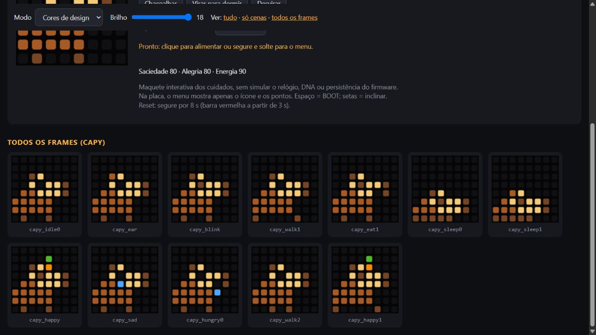
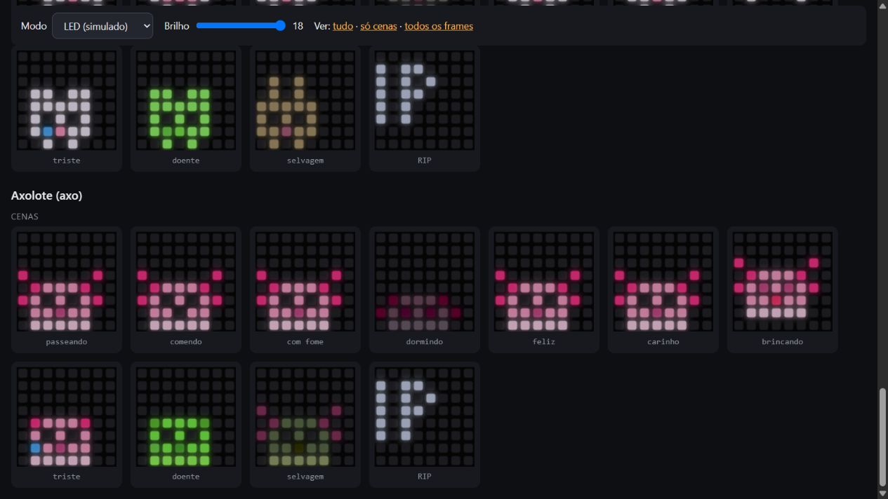

# Como jogar e como o bichinho vive

[README](../README.md) · [Montar o seu](GUIA-MONTAGEM.md) · [Como jogar](JOGO.md) · [Editor](EDITOR.md) · [Hardware](HARDWARE.md) · [Desenvolvimento](DESENVOLVIMENTO.md) · [Prompts para IA](PROMPTS-IA.md) · [English](en/GAME.md)

Tudo aqui vale igual para a placa e para o simulador do site, exceto onde
estiver indicado. Os tempos do simulador são encurtados para demonstração.

## Os bichinhos

Ver as poses da capivara

Ver um exemplo da galeria de animações

A galeria do simulador mostra as poses de cada espécie antes de gravar a placa.

Capivara, gato, sapo, pintinho, coelho e axolote. Cada espécie tem
animações de descanso, caminhada, piscar, comer, dormir, felicidade,
tristeza (a lágrima escorre), fome e cansaço (cabeceando e bocejando),
além de uma paleta de ovo e uma variante selvagem.

- **Gato:** sentado, orelhas triangulares com interior rosa, olhos
  apagados, focinho e peito creme, patas e cauda que se mexe.
- **Capivara:** de perfil, corpo arredondado, orelha pequena, focinho
  comprido e largo, nariz separado e pernas curtas. Quando feliz,
  equilibra uma tangerina na cabeça.
- Durante os cuidados, comida e corações usam **pixels livres ao redor do pet**, preservando a
  silhueta e o rosto mesmo com apenas 64 pixels. Dormir usa uma pose
  mais baixa e reduz o brilho.
- A capivara descansa e fareja mais; o gato observa e persegue mais.
  O DNA continua variando personalidade e tonalidade de cada indivíduo.
- Cada bicho tem um **nome próprio** tirado do DNA (ex.: KALU, MOBITE).
  Ele se apresenta ao nascer, abre a tela de status e vai na lápide.
- Cansado (energia < 25), ele fica parado cabeceando. Se ninguém clicar
  nem fizer um gesto por 30 s, dorme sozinho; dormindo recupera 1 de
  energia por minuto e acorda sozinho quando enche.

## Acontecimentos, refeição e sonhos

**Refeição.** O pet olha para o lado do focinho, a comida (1 ou 2 pixels nas
cores dela) aparece no primeiro pixel livre à frente da boca, ele se aproxima
quando cabe e mastiga enquanto a comida diminui; no fim fica satisfeito e um
coraçãozinho aparece. A silhueta nunca é substituída. A capivara mastiga sem
sair do lugar (o focinho comprido já encosta na borda) e move a mandíbula.
Cada refeição continua dando o mesmo ganho fixo de saciedade.

**Acordado**, pausas alternam com pequenas intenções: farejar um ponto no
chão, olhar em volta, observar algo passando no alto, seguir uma borboleta
e bocejar/se acomodar antes de um cochilo. O DNA escolhe as frequências e o
tamanho das pausas. A capivara fareja e observa com calma; o gato observa
mais, com atenção. BOOT ou movimento interrompem o acontecimento na hora, e
um cuidado pedido sempre tem prioridade.

**Conway ao redor do pet.** Depois de 2 minutos sem BOOT nem movimento, com
energia suficiente e sem necessidade urgente, o pet para e observa por 7 s,
a cada 45 s: um glider atravessando (visitas pares) ou um blinker pulsando
com um passarinho (ímpares). As células aparecem só nos pixels livres com
1 px de respiro do pet; o autômato continua completo por baixo da máscara.

**Sono.** Pelo menu, pelo gesto ou pelo cochilo automático de energia baixa,
o pet fica visível por 8 s; depois fecha os olhos, bolhinhas saem da cabeça
e uma bolha cresce até virar o mundo inteiro, substituindo o pet pixel a
pixel. O sonho troca de capítulo a cada 20–40 s (gliders atravessando,
pulsações e grupos nascendo e se desfazendo), também por substituição de
pixels. Um padrão vazio ou imóvel prepara o capítulo seguinte na hora; um
oscilador que sobrou pulsa no máximo 10 s. Mexer ou chacoalhar mostra o pet
dormindo por mais 8 s sem acordá-lo e o sonho volta pela bolha; BOOT acorda,
e ele também acorda quando recupera toda a energia.

Uma geração a cada meio segundo, bordas conectadas. DNA, estado e contador de
capítulos escolhem padrão, orientação e posição de forma reproduzível; tons
frios indicam um sonho tranquilo e tons quentes um sonho inquieto. Isso só
muda a exibição: não altera fome, energia nem as regras de alimentação. As
regras e o glider seguem a referência do
[Jogo da Vida em matriz de LEDs](https://www.makerguides.com/game-of-life-dot-matrix-max7219/).
O preview encurta só a espera ociosa (12 s em vez de 2 min); veja o
[roteiro dos sonhos](TESTES.md#sonhos-e-conway) e o
[plano de animações e Conway](ANIMACOES-E-CONWAY.md).

Os desenhos são originais, feitos diretamente na grade de pixels.
Referências de forma: [perfil de capivara (WWF)](https://www.wwf.or.jp/staffblog/news/5510.html)
e [silhueta de gato sentado](https://freesvg.org/black-cat-vector-image).
As imagens de referência não são distribuídas no projeto.

## Controles

**Uma regra para os menus: clique troca, segurar e soltar confirma.**
Após **0,6 s**, um ponto verde no canto superior direito indica que já
pode soltar. A ação longa só acontece ao soltar o botão.

| Situação | Entrada | Resultado |
|---|---|---|
| Seleção inicial | Clique no BOOT ou incline para um lado | Próxima espécie; inclinar à esquerda volta. Um bichinho enviado pelo [editor](EDITOR.md) aparece como 7ª espécie |
| Seleção inicial | Segure BOOT por 0,6 s e solte | Escolhe a espécie e começa o ovo |
| Ovo | Movimente suavemente a placa | Acumula incubação: 5 minutos; parar por 15 s pausa, sem zerar |
| Ovo | Clique no BOOT | Mostra o progresso no topo por 2 s |
| Pet acordado | Clique no BOOT | Alimenta, com animação de comida → mastigação → coração |
| Pet dormindo | Clique no BOOT | Acorda; não alimenta junto |
| Vida | Segure BOOT por 0,6 s e solte | Abre o menu no cuidado mais urgente |
| Menu | Clique ou incline | Troca o ícone; volte ao centro antes da próxima inclinação |
| Menu | Segure BOOT por 0,6 s e solte | Executa o cuidado selecionado |
| Vida | Chacoalhe | Brinca: alegria +20, energia −8, saciedade −3; pausa de 5 s entre gestos |
| Vida | Incline lateralmente | O pet acompanha o lado mais baixo |
| Vida | Vire a matriz para baixo por 1,5 s | Dorme |
| Sono iniciado pelo gesto | Desvire | Acorda; o sono escolhido no menu continua até BOOT/menu ou energia cheia |
| Status | Espere ou clique | Nome → comida → alegria → energia → saúde → idade → volta ao pet |
| Status | Segure BOOT por 0,6 s e solte | Volta ao pet na hora |
| Qualquer cena | Segure BOOT por 8 s | Recomeça na seleção; barra vermelha a partir de 3 s |
| Após a morte | Segure BOOT por 0,6 s e solte | Recomeça na seleção |

### Menu em 8×8

Ordem dos oito ícones/pontos: **maçã (vermelho) · controle (roxo) · bolhas
(azul-claro) · cruz de farmácia (verde) · lua (amarelo) · coração (rosa) ·
barras · voltar (branco)**. O ponto branco na última linha indica a posição.
O menu fecha após 8 s sem entrada. Sem IMU, todos os cuidados continuam
acessíveis pelo BOOT.

**Quando o bicho precisa de algo**, a cada 4 s a tela mostra por um
instante o ícone do menu que resolve. No resto do tempo, um pontinho pisca
no canto superior direito com a cor desse ícone: verde doente, azul-claro
sujo, vermelho fome, amarelo cansado, roxo entediado/triste. Segurar o BOOT
abre o menu já nesse ícone.

**Status**: primeiro passa o nome do bicho. Depois vem uma página por
atributo: ícone em cima, barra de 8 LEDs embaixo e o nome escrito rolando.
COMIDA cheia = satisfeito, ALEGRIA, ENERGIA e SAUDE (vira DOENTE ou SUJO
quando for o caso; cai quando você descuida). Ícone piscando = atributo
baixo. Por fim, a idade em dias.

O menu sugere acordar se estiver dormindo; caso contrário, prioriza doença,
sujeira, fome, cansaço e tristeza. Quando está tudo bem, sugere carinho.
Carinho aumenta a alegria em 5 pontos sem gastar energia.

Sacudidas não interrompem uma animação de cuidado nem acordam o pet.
Comida é recusada se ele já estiver cheio; brincadeira, se faltar energia.
Segurar para reset não executa uma confirmação intermediária.

## Vida e persistência

O estado fica salvo na NVS e sobrevive a reinícios. A fome, felicidade e
energia decaem lentamente, com taxas e personalidade em `src/Config.h`
e `src/Dna.h`. Durante o sono, a energia regenera e a fome cai mais devagar.
O relógio só avança enquanto a placa está ligada.

Sujeira e fome prolongada causam doença. O descuido acumula em estágios:
normal → descuidado → quase selvagem → selvagem. O pet selvagem fica arisco,
procura comida sozinho e pode morrer após cinco dias nessa condição.
Bem cuidado, vive indefinidamente. Esses cuidados já existiam no projeto.
