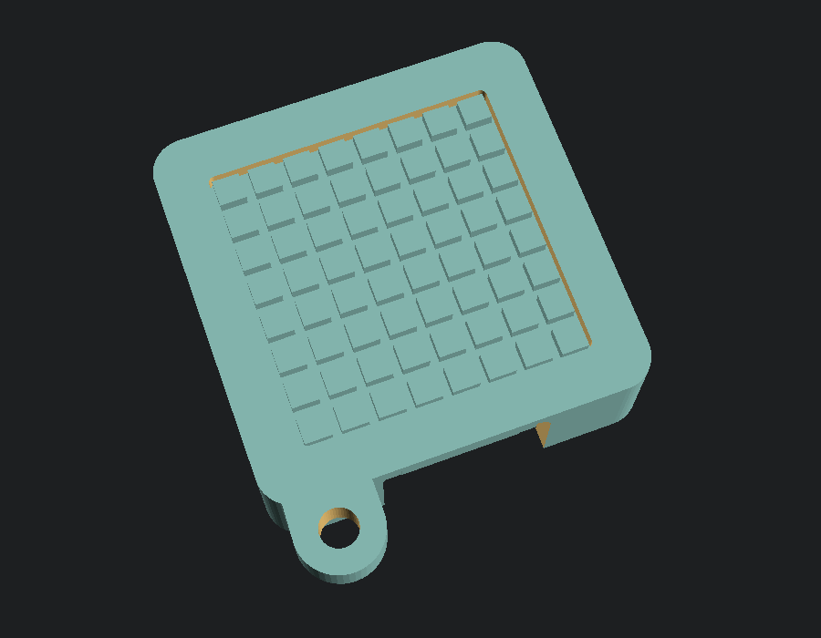
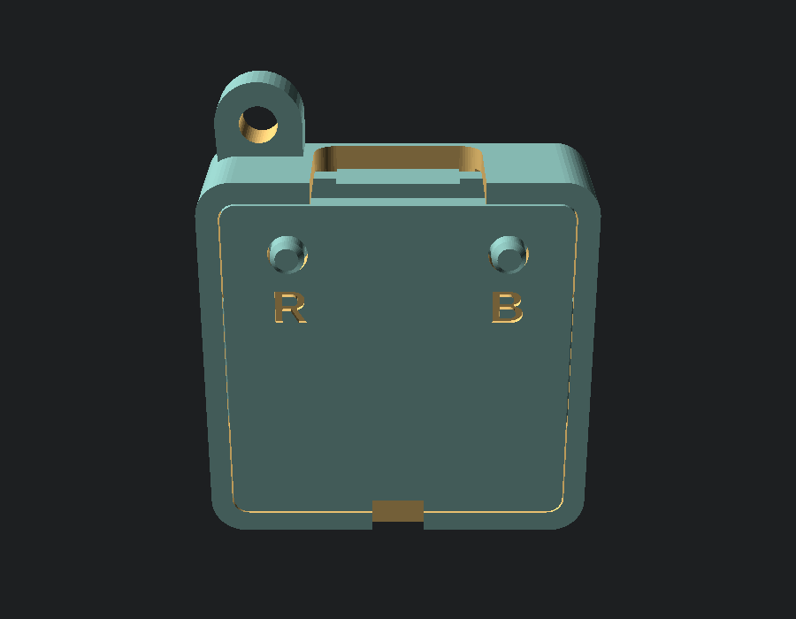
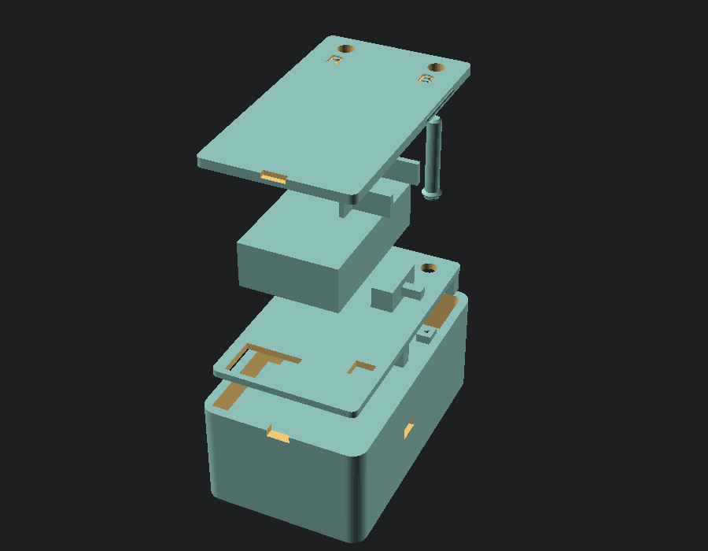
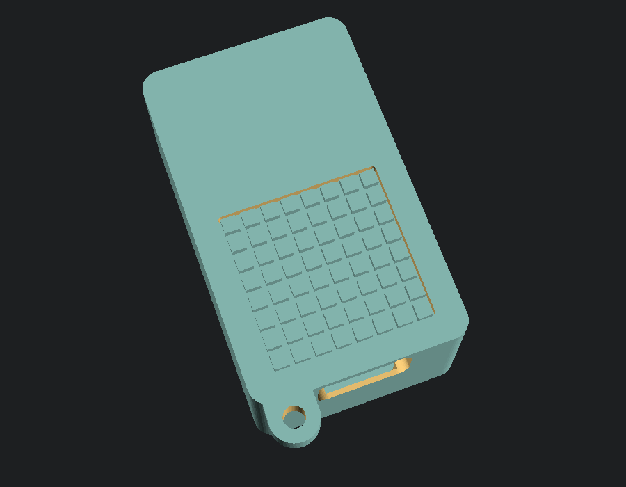
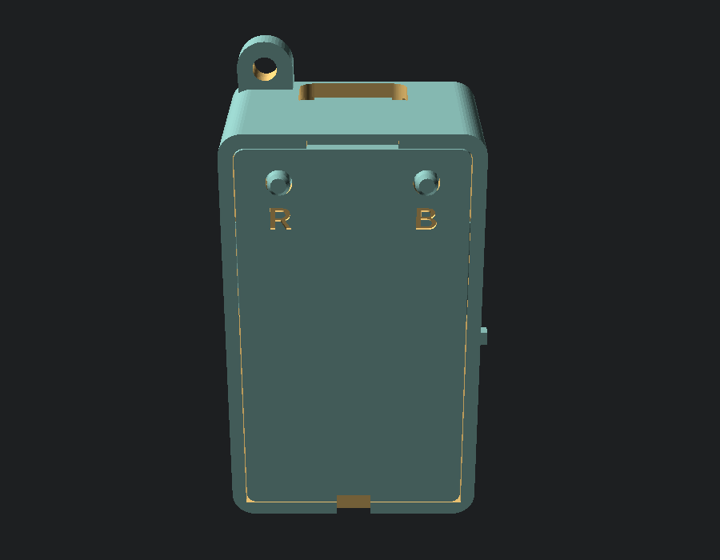

# PixelGotchi case

[Português](README.md) · **English**

A 3D-printed case for the Waveshare ESP32-S3-Matrix: **28.7 × 28.7 × 8.6 mm**
(11 mm for the diffuser version), with access to the USB-C, the two back
buttons (BOOT and RESET) and a keychain loop.


| Front (open) | Back |
|---|---|
|  |  |

## Parts

| File | Quantity | Print |
|---|---|---|
| `stl/front_open.stl` **or** `stl/front_diffuser.stl` | 1 | front face on the bed |
| `stl/back.stl` | 1 | already oriented with the outside on the bed |
| `stl/pin.stl` | 2 (+1 spare) | already upside down |

- **front_open**: open window, the LEDs show directly. Any color.
- **front_diffuser**: a thin (0.6 mm) front face with an 8×8 grid inside, so
  each LED becomes a little square "pixel", Tamagotchi style. Print it in
  **white or natural PLA** (light has to go through).

## How the buttons work

Each button has a **loose pin** that goes through the cover and only touches
the board's button. Pressing the pin presses the button. Since the pin can
slide out, it **never stays pressed on its own** — important, because BOOT
held at power-up enters flashing mode and RESET held keeps the board stuck. A
flange on the pin keeps it from falling out.

## Settings for the Ender-3 V3 KE (Creality Print)

| Setting | Case (front/back) | Pins |
|---|---|---|
| Material | PLA | PLA |
| Layer | 0.16–0.2 mm | 0.12 mm |
| Walls | 4 (1.6 mm) | 3 |
| Infill | 20% | 100% |
| Supports | **no** | **no** |
| Adhesion | none/skirt | **brim** (tiny part) |

Tips:
- Print the pins together with the case (or several at once) so each layer
  has time to cool; printed alone they melt.
- On the diffuser version, the 0.6 mm face is 3–4 layers: keep the first
  layer well calibrated. Thinner = more light; if it is too see-through, raise
  `diff_t` to 0.8.
- If the cover fits too tight or too loose, adjust `plate_fit` (0.12 mm per
  side) — every printer has its own tolerance.

## Assembly

1. Place the board **LEDs facing down** inside the front, with the USB-C
   aligned with the top opening. It rests on the window edge.
2. Put the two pins over the buttons (thin tip down). Standing on the cover:
   the **R** hole sits over RESET and the **B** hole over BOOT.
3. Snap the cover on from the back, passing the pins through the holes, until
   it clicks.
4. To open: a fingernail or thin screwdriver in the bottom notch.

## Measurements and what is still an estimate

They came from Waveshare's dimensioned drawing and from board photos (using
the 2.54 mm pin pitch as a ruler). They are at the top of `pixelgochi_case.scad`
and `placa.scad`:

| Measurement | Value | Confidence |
|---|---|---|
| Board, corners | 25.00 × 25.00 mm, R1 | high (dimensioned) |
| USB-C | centered, sticks out ~0.8 mm from the edge, 3.26 mm tall | medium |
| Buttons | 4.6 mm from the sides, 3.6 mm from the top | medium (±0.5 mm) — the pin has a 1.8 mm tip to tolerate it |
| Button height | ~2.0 mm | low — the pin tolerates 1.5 to 2.5 mm |
| Board thickness | 1.6 mm | medium — if it is loose, a small piece of tape solves it |
| LED pitch | ~2.7 mm | medium — **only matters for the diffuser grid** |

If something does not fit, measure it with a ruler/caliper, adjust the value
in the `.scad` and generate again.

## Generating the STLs

Needs [OpenSCAD](https://openscad.org/downloads.html):

```bash
python tools/build_case.py
```

It checks for **collisions** (a simplified board must not touch any part),
generates the 4 STLs in `stl/` and the images in `images/`. To view/adjust
live, open `pixelgochi_case.scad` in OpenSCAD and change `PART`
(`"assembly"`, `"exploded"`, `"front"`, `"back"`, `"pin"`), `STYLE` and `KEYCHAIN`.

---

# Battery version

Same width, taller: **28.7 × 47.7 × 18.8 mm**. The screen is on top; below
it, the charger; behind the board, a shelf and then the battery, with the
power switch on a side strip. It charges through **the board's own USB-C**:
plug in the cable and it charges and runs.



| Front | Back |
|---|---|
|  |  |

## Printed parts

| File | Quantity | Print |
|---|---|---|
| `stl/bateria_front_open.stl` **or** `stl/bateria_front_diffuser.stl` | 1 | front face on the bed |
| `stl/bateria_mid.stl` | 1 | as is (flat side on the bed) |
| `stl/bateria_lid.stl` | 1 | as is (outside on the bed) |
| `stl/bateria_pin.stl` | 2 (+1 spare) | as is, with a brim |

Same print settings as the version without a battery.

## Shopping list

| Part | What to look for | Note |
|---|---|---|
| Battery | an **HC 801723, 160 mAh** | Check it is not swollen and reads more than ~3.0 V |
| Charger | "**TP4056 charger module with protection**, micro USB" (~25 × 18 mm) | **A resistor must be replaced** (below). The plain 22 × 17 mm one also fits, but only use it if the battery has its own protection |
| Switch | "**SS12D00** slide switch" (mini, 2 positions) | Body ~8.7 × 3.7 × 3.6 mm |
| Diode | "**1N5819** Schottky diode" (or SS14) | Keeps the battery from receiving the USB 5 V uncontrolled |
| Resistor | **10 kΩ SMD 0603** (or 0805, to match the module) | Changes the charge current |
| Connector | mating connector for the battery (or cut and splice) | |
| Wires | thin wire (30 AWG / wire-wrap), thin double-sided tape | |

### Charge current (important)

TP4056 modules ship set to **1 A**, six times more than a 160 mAh battery can
take. Replace resistor **R3** (usually marked `122`, i.e. 1.2 kΩ) with a
**10 kΩ** one (`103`): the charge drops to ~120 mA. **Do not connect the
battery without this change.**

## Wiring

The board has no charger: USB goes through a diode (D1) onto the 5 V line,
which powers the LEDs and the 3.3 V regulator. The battery joins that same
line, through the **5V** pad on the back, via a diode — so USB never charges
the battery "by force" (only the TP4056 charges it) and the battery never
back-feeds the cable.

```
Board 5V pad ─────┬──────────────── TP4056 IN+   (charges while USB is connected)
                  │
                  └──|◄── switch ── TP4056 OUT+
                     1N5819: the band (cathode) goes on the 5V pad side

Board GND pad ───────────────────── TP4056 IN−   (on the protected module, IN− = OUT−)
Battery + ── TP4056 B+             Battery − ── TP4056 B−
```

On the **plain** module (no protection) there is no OUT+: the switch goes on **B+**.

- The **5V** and **GND** pads are on the back of the board, near the RESET
  button (see the back photo in the main README).
- Never connect the battery straight to the 5V pad (without a diode) nor to
  the **3V3** pin: with USB plugged in it would get uncontrolled charging, and
  on 3V3 its 4.2 V would burn the ESP32 and the sensor.
- With the switch **off** the battery still charges over USB; the switch only
  cuts the board's power from the battery.
- Estimated runtime: **~1.5 h** (the 64 LEDs draw current even when off).

## Assembly

1. Do the wiring above **outside the case** and test it: with the switch on
   and no USB, PixelGotchi should start; with USB, the TP4056 LED should show
   charging.
2. Place the board LEDs facing down in the body (USB in the top opening) and
   the TP4056 in the compartment below it (double-sided tape). The diode and
   the pad wires go in the gap behind the board.
3. Fit the shelf (posts down, over the board corners), passing the battery and
   switch wires through the openings.
4. Battery in the left area (looking at the back), wires down; switch in the
   right strip, with the lever sticking out of the side.
5. Pins in the shelf holes (thin tip down) and close with the lid until it clicks.

## Battery measurements

The HC 801723 cell alone is 8.0 × 17 × 23 mm; with the little board/tape at
the end it often goes past 27 mm. Measure yours and adjust `bat_l`, `bat_w`,
`bat_t` in `pixelgochi_case_bateria.scad` (the file warns if it does not fit)
and generate again with `python tools/build_case.py bateria`.
